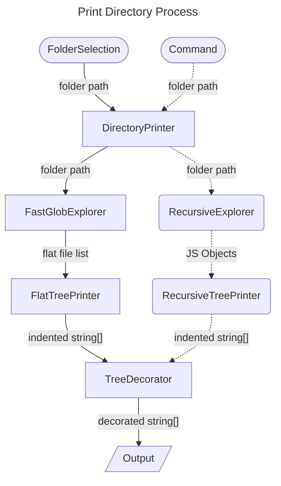

## The Print Directory Process

**NOTE**: The dotted lines indicate alternate processes

```mermaid
---
title: Print Directory Process
---

flowchart TB

    fs([FolderSelection]) -- folder path --> DirectoryPrinter
    command([Command]) -. folder path .-> DirectoryPrinter

    DirectoryPrinter -- folder path --> FastGlobExplorer
    DirectoryPrinter -. folder path .-> recx(RecursiveExplorer) 

    FastGlobExplorer -- flat file list --> FlatTreePrinter
    FlatTreePrinter -- indented string[] --> TreeDecorator

    recx -. JS Objects .-> retp(RecursiveTreePrinter)
    retp -. indented string[] .-> TreeDecorator

    TreeDecorator -- decorated string[] --> output[/Output/]
```