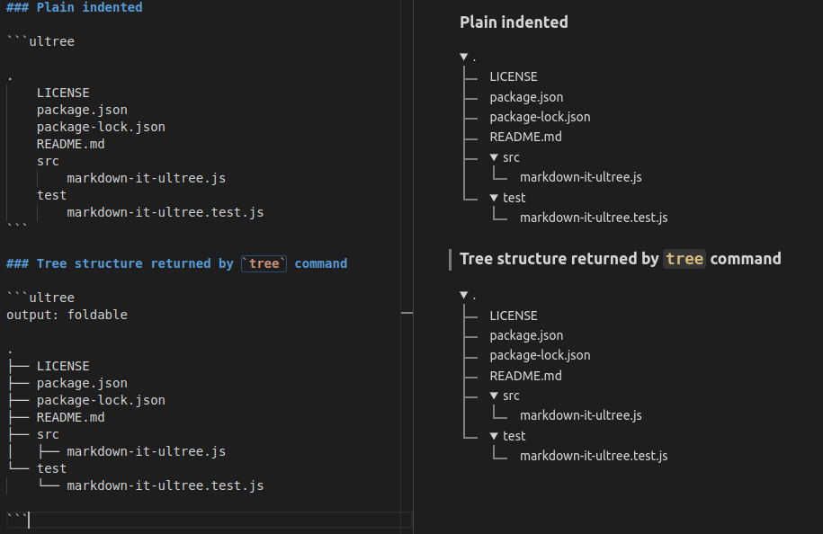

# Markdown Tree extension for Visual Studio Code

Generate collapsible/expandable trees in markdown

## Installation

This extension is available at [Visual Studio Code marketplace](https://marketplace.visualstudio.com/items?itemName=UltraByteSoftwares.markdown-tree) and can also be installed from within VSCode.

## Features

- Generate trees from space/tab indented text
- Supports generating trees from the output of `tree` command

### Preview



## Usage

- Write your tree items inside `ultree` fenced code block

    <pre>
    ```ultree
        RootFolder
            LICENSE
            package.json
            src
                main.js
    ```</pre>
  
- Use either tabs or spaces to indent (but not both together inside `ultree` block)

## Options
Options can be specified as `key: value` pairs at the beginning of the body of `ultree` block.

Here are the currently supported options

| Option     | Possible values | Description                                        |
| ---------- | --------------- | -------------------------------------------------- |
| **output** | `foldable`      | (default) Output a foldable tree                   |
|            | `simple`        | Output a non-foldable tree                         |
| **open**   | `true`          | (default) Keep foldable tree expanded at the start |
|            | `false`         | Keep foldable tree collapsed at the start          |

## Release Notes

### August [Unreleased]

Generate trees from any folder via a right click option or through the command pallete.

Detailed changes in [CHANGELOG](./CHANGELOG.md)
