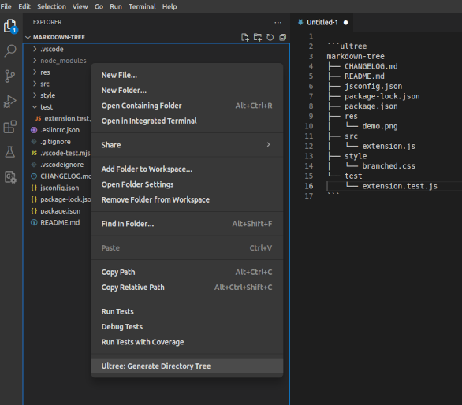

# Markdown Tree extension for Visual Studio Code

Generate collapsible/expandable trees from plain text or from any folder in markdown.

The items are rendered inside `<details>` and `<summary>` HTML elements in the output.

## Installation

This extension is available at [Visual Studio Code marketplace](https://marketplace.visualstudio.com/items?itemName=UltraByteSoftwares.markdown-tree) and can also be installed from within VSCode.

## Features

### Generate tree from any folder

- Place your cursor anywhere you want the output (need not be only inside `ultree` block)
- Click on `Ultree: Generate Directory Tree` in the file-explorer right-click menu



- You can also provide an absolute path to the command `Ultree: Generate Tree from Path` from the command palette

### Generate trees from plain text

- Just type in your indented text to render a tree
- Copying output from output of `tree` command works too


## Usage

- Write your tree items inside `ultree` fenced code block

    <pre>
    ```ultree
        RootFolder
            LICENSE
            package.json
            src
                main.js
    ```</pre>
  
- Use either tabs or spaces to indent (but not both together inside `ultree` block)

## Options

Render options can be specified as `key: value` pairs at the beginning of the body of `ultree` block.

Here are the currently supported options

| Option     | Possible values | Description                                        |
| ---------- | --------------- | -------------------------------------------------- |
| **output** | `foldable`      | (default) Output a foldable tree                   |
|            | `simple`        | Output a non-foldable tree                         |
| **open**   | `true`          | (default) Keep foldable tree expanded at the start |
|            | `false`         | Keep foldable tree collapsed at the start          |

## Settings

You can tinker a few settings like **ignoring some files and folders**, **control indentation** or **max depth of recursion** and a few more from the configurations page.

Go to **File->Preferences->Settings** or hit `Ctrl+,` and search for `ultree` on the settings page.

## Feedback

Please drop your suggestions, bugs or feature requests at the project's [GitHub issues](https://github.com/UltraByteSoftwares/vscode-markdown-tree/issues) page.

## Release Notes

### August 2024 (v1.1.0)

Generate trees from any folder via a right click option or through the command pallete.

Detailed changes in [CHANGELOG](./CHANGELOG.md)

### August 2024 (v1.0.1)

Initial release